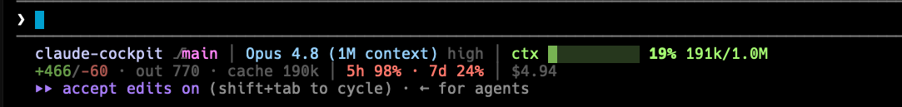

# claude-cockpit

A cockpit for [Claude Code](https://claude.com/claude-code): live session
instruments plus timely control suggestions for long-running agent work.

`claude-cockpit` does not fly the session for you. It keeps the important gauges
visible, detects when the session is drifting into expensive or repetitive work,
and suggests the next control to use: `/compact`, `/clear`, a cheaper model,
a skill, a subagent, MCP, graphify, or an audited third-party workflow tool.



## Install

**One command. No Go, no jq, no runtime.**

```bash
curl -fsSL https://raw.githubusercontent.com/Agent-Hellboy/claude-cockpit/main/install.sh | bash
```

The installer detects your OS and CPU architecture, downloads the matching
prebuilt release asset, installs it to `~/.claude/bin/cockpit`, clears the macOS
quarantine bit, and self-registers `statusLine` + the `Stop` hook into
`~/.claude/settings.json` (merging, never overwriting — your other settings and
hooks are preserved; a timestamped backup is made).

Supported prebuilt targets:

- macOS: Apple Silicon (`darwin/arm64`) and Intel (`darwin/amd64`)
- Linux: `linux/arm64` and `linux/amd64`

Install a specific release:

```bash
curl -fsSL https://raw.githubusercontent.com/Agent-Hellboy/claude-cockpit/main/install.sh | COCKPIT_VERSION=v0.1.0 bash
```

Then **restart Claude Code** (or run `/hooks`) so the Stop hook loads. The status
bar appears immediately.

> Prefer to build it yourself? `go install github.com/Agent-Hellboy/claude-cockpit/cmd/cockpit@latest && cockpit install`

### Uninstall

```bash
~/.claude/bin/cockpit uninstall
```

Removes only cockpit's entries (foreign hooks and other settings are kept),
deletes transient state, and backs up `settings.json`.

## What you get

**1. Flight instruments** (`cockpit statusline`) — two rows, never truncated:
- **Row 1:** dir + branch (+ PR number/review state), model + effort, and a
  context-fill gauge that turns yellow ≥70%, red ≥90% with a `⚠ /compact` cue.
- **Row 2:** session churn (`+/-` lines), output/cache tokens, 5h/7d rate-limit
  usage, and session cost.
- **Row 3 (only when present):** the latest suggestion from the analyzer.

**2. Control advisor** (`cockpit analyze`, a `Stop` hook) — after each turn it
gathers cheap signals (turn count, ~context size, tool/search usage, current
model, available Claude Code extensions, graphify state, repo size) and asks a
fast model (`haiku`) for the 1–3 highest-leverage
optimizations *right now*. It is **advisory** — it never changes your session;
you act on the suggestion (`/model`, Shift+Tab, `/graphify`, …).

Design notes:
- **Cockpit, not autopilot** — cockpit suggests controls and asks before risky
  actions. It never silently changes models, installs tools, or edits settings.
- **Cheap by construction** — signals are gathered in-process (no subprocess
  fan-out); the model only sees a compact summary, throttled by an auto-scaling
  cadence.
- **Auto-scales** — short sessions are analyzed rarely (every 10th turn), long
  sessions almost every turn, so analysis surfaces on its own as you go.
- **No-graph aware** — if there's no graphify graph and you're searching a lot, it
  offers to build one with a repo-size-scaled ETA instead of suggesting a query
  that can't run.
- **Claude Code aware** — suggestions can point at `/context`, `/compact`,
  built-in skills, subagents, MCP servers/resources, local plugins, graphify, and
  other installed workflow tools. If it suggests a new third-party tool, it asks
  you to audit it first because MCP servers and plugins can receive powerful
  local or account access.
- **Non-blocking** — the analysis runs in a fully detached background process, so
  your turn never waits on it. Results land in `~/.claude/.session-report` and
  the status bar.

## Requirements

- The `claude` CLI on your `PATH` (the analyzer shells out to it for suggestions;
  the status line works without it).
- `curl` + `tar` to run the installer.

## How it works

Every `Stop` hook bumps a per-session counter. Cockpit analyzes short sessions
rarely, then checks more often as the session gets long:

- turns 1-9: every 10th turn
- turns 10-24: every 5th turn
- turns 25+: every 2nd turn

When it runs, the analyzer writes a compact signal packet to an **ephemeral temp
file** (`$TMPDIR/cockpit-sig-*`) and hands the path to a detached worker. The
worker reads it, **deletes it immediately**, and asks `claude -p` for
suggestions. The signal packet (which includes your recent prompts) is never
persisted to disk. The worker then writes its top suggestion to
`~/.claude/.model-hint` and the full list to `~/.claude/.session-report`. The
status line reads `.model-hint` to show row 3. A `MODEL_HINT_GUARD` env var stops
the background `claude -p` call from re-triggering the hook.

### Files & data

| Path | Lifetime | Contents |
|---|---|---|
| `$TMPDIR/cockpit-sig-*` | **ephemeral** — deleted the instant the worker reads it | the signal packet sent to the model |
| `~/.claude/.model-hint` | until the next analysis | top suggestion (status bar row 3) |
| `~/.claude/.session-report` | until the next analysis | full 1–3 line suggestion list |
| `~/.claude/.sa-count-<session>` | per session | turn counter driving the cadence |
| `~/.claude/.cockpit-debug.log` | only if `COCKPIT_DEBUG=1` | minimal diagnostics |

Nothing is sent anywhere except your own `claude -p` invocation. `uninstall`
removes the persisted files above.

Analyzer privacy/debug controls:

- `COCKPIT_ANALYZE_DISABLE=1` disables the analyzer; the status line still works.
- `COCKPIT_ANALYZE_PROMPTS=0` omits recent user prompt text from worker signals.
- `COCKPIT_DEBUG=1` writes minimal diagnostics to `~/.claude/.cockpit-debug.log`.
- `CLAUDE_CONFIG_DIR` changes the Claude config directory; `COCKPIT_VERSION`
  pins the installer to a release tag.

By default, the analyzer sends only a compact summary to the background
`claude -p --model haiku` worker: counts, current model, tool/search signals,
repo estimate, graphify state, available extension names, and up to eight recent
user prompts. Obvious secret-like assignments in prompts are redacted before the
worker file is written.

## Subcommands

| Command | Purpose |
|---|---|
| `cockpit statusline` | render the status bar (stdin = Claude Code's status JSON) |
| `cockpit analyze` | the `Stop` hook (stdin = hook JSON) |
| `cockpit install` / `uninstall` | register/unregister in settings.json |
| `cockpit version` | print version |
| `cockpit worker FILE` | internal: detached background classifier |

## Build & test (contributors)

```bash
go build ./... && go test ./... -race
```

Releases are cut by tagging: `git tag v0.1.0 && git push --tags` triggers the
GitHub Actions `release` workflow (goreleaser) to build and publish darwin/linux
× amd64/arm64 binaries.

## Caveats

- Hooks are **advisory** in Claude Code — they can suggest, not switch models or
  enter plan mode. You act on the suggestion.
- The analyzer infers your *current* model from the transcript, so an occasional
  already-on-Sonnet suggestion is harmless.

## License

MIT — see [LICENSE](LICENSE).
