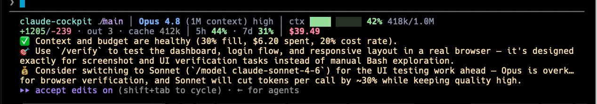
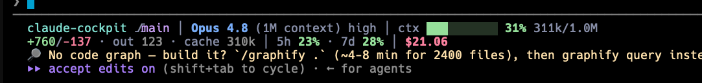
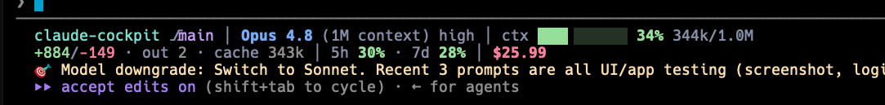
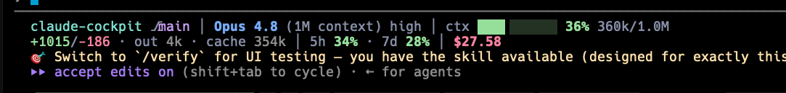

# claude-cockpit

Live instruments and control suggestions for long-running Claude Code sessions.

`claude-cockpit` adds a compact status line to Claude Code and uses the `Stop`
hook to suggest the next useful control before a session gets expensive,
repetitive, or hard to steer. It does not automate your session or change your
settings without you.


## Why use it

- See branch, PR state, model, effort, context pressure, token churn, rate-limit
  usage, and session cost while you work.
- Get timely suggestions for `/compact`, `/clear`, model changes, skills,
  subagents, MCP, graphify, or workflow tools.
- Keep suggestions advisory and reversible: cockpit shows the control, you choose
  whether to use it.
- Install one small binary with no Go, jq, or runtime dependency.

## Install

```bash
curl -fsSL https://raw.githubusercontent.com/Agent-Hellboy/claude-cockpit/main/install.sh | bash
```

Then restart Claude Code, or run `/hooks`, so the hook loads.

The installer downloads the matching macOS or Linux release binary, installs it
to `~/.claude/bin/cockpit`, and merges the `statusLine` plus `Stop` hook into
`~/.claude/settings.json`. Existing Claude settings and hooks are preserved, with
a timestamped backup.

To install a specific release:

```bash
curl -fsSL https://raw.githubusercontent.com/Agent-Hellboy/claude-cockpit/main/install.sh | COCKPIT_VERSION=v0.1.0 bash
```

Build from source:

```bash
go install github.com/Agent-Hellboy/claude-cockpit/cmd/cockpit@latest
cockpit install
```

## What it shows



- **Status line:** project, git state, model, effort, context fill, token churn,
  cache/output tokens, rate limits, and cost.
- **Session advisor:** a background `haiku` check that surfaces the highest-value
  next controls for the current session.
- **Tool awareness:** suggestions can reference Claude Code commands, installed
  skills, subagents, MCP resources, graphify state, and audited third-party tool
  gaps.
- **Non-blocking runtime:** analysis runs detached, so your turn does not wait on
  the advisor.

More examples:





## Commands

| Command | Purpose |
|---|---|
| `cockpit install` | Register the status line and `Stop` hook |
| `cockpit uninstall` | Remove cockpit settings and transient state |
| `cockpit statusline` | Render the Claude Code status line |
| `cockpit analyze` | Run the `Stop` hook analyzer |
| `cockpit version` | Print the installed version |

Uninstall:

```bash
~/.claude/bin/cockpit uninstall
```

## Privacy and controls

Cockpit writes session state under `~/.claude/` and sends compact session signals
only through your own `claude -p --model haiku` invocation. Web search is used
only when the advisor detects a tool gap that needs current external discovery.

Useful environment variables:

| Variable | Effect |
|---|---|
| `COCKPIT_ANALYZE_DISABLE=1` | Disable advisor analysis; keep the status line |
| `COCKPIT_ANALYZE_PROMPTS=0` | Omit recent prompt text from analyzer signals |
| `COCKPIT_DEBUG=1` | Write debug logs to `~/.claude/.cockpit-debug.log` |
| `CLAUDE_CONFIG_DIR` | Use a different Claude config directory |
| `COCKPIT_VERSION` | Pin installer downloads to a release tag |

## Requirements

- Claude Code installed.
- `curl` and `tar` for the installer.
- macOS or Linux on amd64 or arm64 for prebuilt binaries.

## Develop

```bash
go build ./...
go test ./... -race
```

Release by pushing a tag such as `v0.1.0`; GitHub Actions builds the prebuilt
macOS and Linux binaries.

## License

MIT. See [LICENSE](LICENSE).
