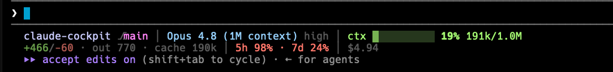
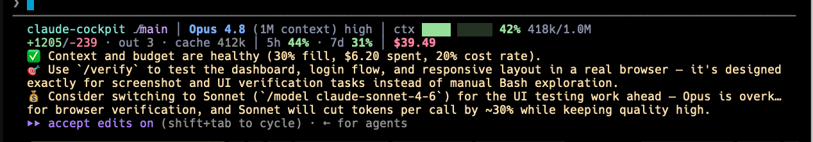
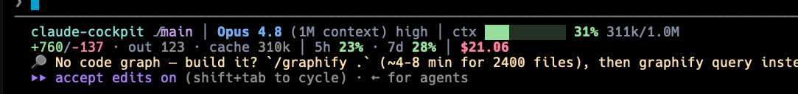
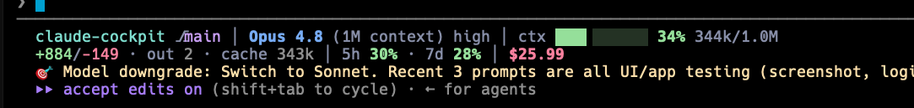
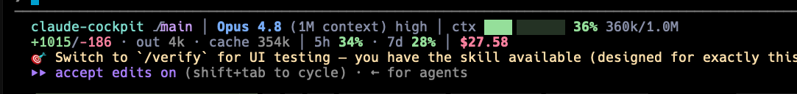

# claude-cockpit

Live instruments and control suggestions for long-running Claude Code sessions.

`claude-cockpit` adds a compact status line to Claude Code and uses the `Stop`
hook to suggest the next useful control before a session gets expensive,
repetitive, or hard to steer. Suggestions are advisory — you choose whether to
pull the lever. When you accept one, `cockpit apply` can wire it into your
project (`CLAUDE.md`, MCP, skills) after you confirm.



## Why use it

- See branch, PR state, model, effort, context pressure, token churn, rate-limit
  usage, and session cost while you work.
- Get timely suggestions for `/compact`, `/clear`, model changes, skills,
  subagents, MCP, graphify, or workflow tools.
- Accept a suggestion in one step: numbered rows in the status bar map to
  `cockpit apply <n>`, which updates project config only after you say yes.
- Install one small binary with no Go, jq, or runtime dependency.

## Install

```bash
curl -fsSL https://raw.githubusercontent.com/Agent-Hellboy/claude-cockpit/main/install.sh | bash
```

Then restart Claude Code, or run `/hooks`, so the hook loads.

The installer downloads the matching macOS or Linux release binary, installs it
to `~/.claude/bin/cockpit`, and merges the `statusLine` plus `Stop` hook into
`~/.claude/settings.json`. Existing Claude settings and hooks are preserved, with
a timestamped backup.

To install a specific release:

```bash
curl -fsSL https://raw.githubusercontent.com/Agent-Hellboy/claude-cockpit/main/install.sh | COCKPIT_VERSION=v0.1.0 bash
```

Build from source:

```bash
go install github.com/Agent-Hellboy/claude-cockpit/cmd/cockpit@latest
cockpit install
```

## What it shows



- **Status line:** project, git state, model, effort, context fill, token churn,
  cache/output tokens, rate limits, and cost.
- **Session advisor:** a background `haiku` check that surfaces the highest-value
  next controls for the current session.
- **Tool awareness:** suggestions can reference Claude Code commands, installed
  skills, subagents, MCP resources, graphify state, and audited third-party tool
  gaps.
- **Non-blocking runtime:** analysis runs detached, so your turn does not wait on
  the advisor.

More examples:





## Accepting suggestions (`cockpit apply`)

After a few turns, the advisor writes 1–3 suggestion lines to the status bar.
Each one is numbered so you can accept it by index:

```
[1] 🔍 Shift exploration to graphify queries — try `graphify query "<question>"`...
[2] 💰 Delegate broad reads to Explore agent (Haiku) — cheaper, keeps context lean...
[3] 🔄 Use `/loop` for CI polling — e.g. `/loop 2m gh run view 12345 --json conclusion`
apply: cockpit apply <n>
```

### List what's available

```bash
cockpit list
```

### Apply a suggestion

```bash
cockpit apply 1          # accept suggestion [1]
cockpit apply 2 --yes    # skip the confirmation prompt
cockpit apply 3 --dry-run  # preview the plan only
```

You can also ask Claude in your session: *"run `cockpit apply 1`"* — same command.

### What happens when you accept

1. Cockpit reads the suggestion and your recent session signals.
2. A focused `haiku` pass turns it into a concrete plan.
3. You see every change and get `Apply this fix? [y/N]:` (unless `--yes`).
4. On confirm, cockpit may:
   - **Append a rule to `CLAUDE.md`** — workflow levers like graphify, `/loop`,
     Explore subagent, model tiering (idempotent; won't duplicate the same rule).
   - **Merge MCP servers into `.mcp.json`** — when the suggestion needs an
     integration (e.g. Playwright, GitHub, Postgres).
   - **Write a project skill** — `.claude/skills/<name>/SKILL.md` when a skill
     should exist locally.
   - **Run safe install commands** — `brew`, `npm`, `npx -y`, etc. (no secrets,
     no destructive flags).
5. The applied suggestion is removed from the status bar.

Restart Claude Code or run `/hooks` after MCP servers are added so they load.

### Flags

| Flag | Effect |
|---|---|
| `--yes` | Apply without prompting |
| `--dry-run` | Show the plan, make no changes |
| `--cwd DIR` | Target a project directory (default: current dir) |

## Commands

| Command | Purpose |
|---|---|
| `cockpit install` | Register the status line and `Stop` hook |
| `cockpit uninstall` | Remove cockpit settings and transient state |
| `cockpit statusline` | Render the Claude Code status line |
| `cockpit analyze` | Run the `Stop` hook analyzer |
| `cockpit list` | Show numbered suggestions |
| `cockpit apply N` | Accept suggestion N — updates `CLAUDE.md`, MCP, skills (with confirmation) |
| `cockpit apply N --dry-run` | Preview what `apply` would do |
| `cockpit version` | Print the installed version |

Uninstall:

```bash
~/.claude/bin/cockpit uninstall
```

## Privacy and controls

Cockpit writes session state under `~/.claude/` and sends compact session signals
only through your own `claude -p --model haiku` invocation. Web search is used
only when the advisor detects a tool gap that needs current external discovery.

Useful environment variables:

| Variable | Effect |
|---|---|
| `COCKPIT_ANALYZE_DISABLE=1` | Disable advisor analysis; keep the status line |
| `COCKPIT_ANALYZE_PROMPTS=0` | Omit recent prompt text from analyzer signals |
| `COCKPIT_DEBUG=1` | Write debug logs to `~/.claude/.cockpit-debug.log` |
| `CLAUDE_CONFIG_DIR` | Use a different Claude config directory |
| `COCKPIT_VERSION` | Pin installer downloads to a release tag |

## Requirements

- Claude Code installed.
- `curl` and `tar` for the installer.
- macOS or Linux on amd64 or arm64 for prebuilt binaries.

## Develop

```bash
go build ./...
go test ./... -race
```

Release by pushing a tag such as `v0.1.0`; GitHub Actions builds the prebuilt
macOS and Linux binaries.

## License

MIT. See [LICENSE](LICENSE).
